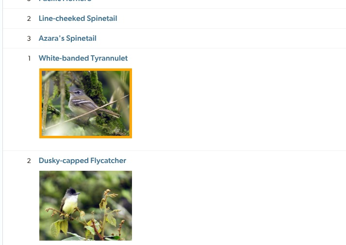
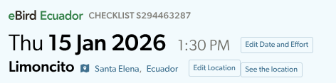

On Chrome/Opera:
Go to about:extensions
Click on "Load unpacked" and add the manifest.json

The two changes are :
* If a picture is not validated, it will be in orange 

* If it's your list, you can "See the location" directly

