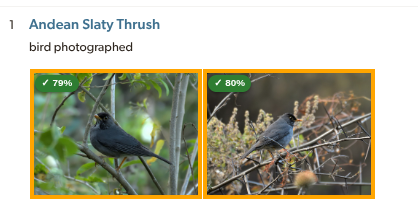
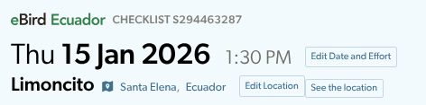
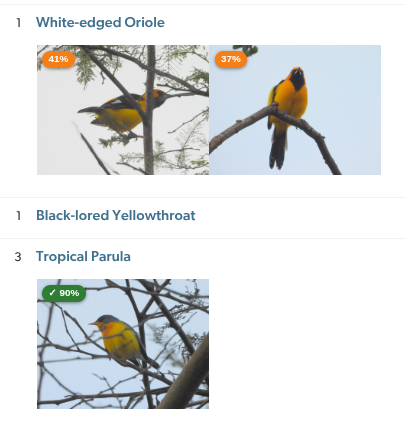
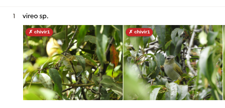
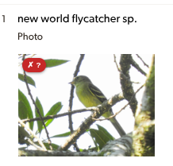
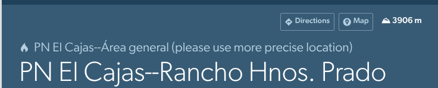

On Chrome/Opera:
* Go to about:extensions
* Click on "Load unpacked" and add the manifest.json

The changes are :

1/ If a picture is not validated, it will be in orange 

2/ If it's your list, you can "See the location" directly

3/ Get Merlin ID on all pictures

* 
   * For the Oriole, Merlin ID is not sure (37-41%, in orange).
   * For the Parula, Merlin ID is confident (90%, in green)
* 
   * For the Vireo, Merlin ID is pretty sure (confident disagree) and suggests a Chivi Viro (chivir1)
* 
  * For the Flycatcher, Merlin ID doesn't know if it is ok or not.

4/ Get altitude of a hotspot

